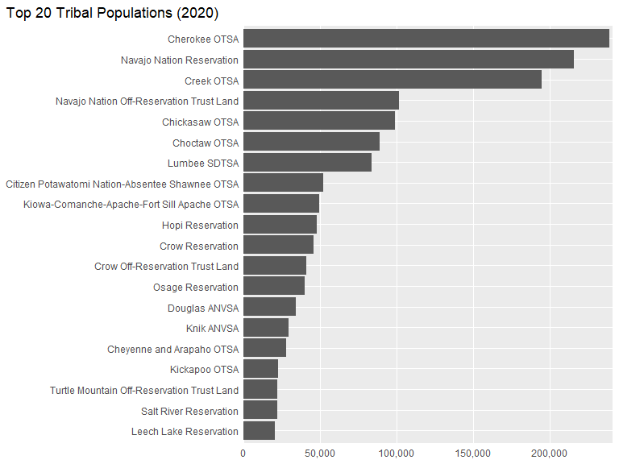
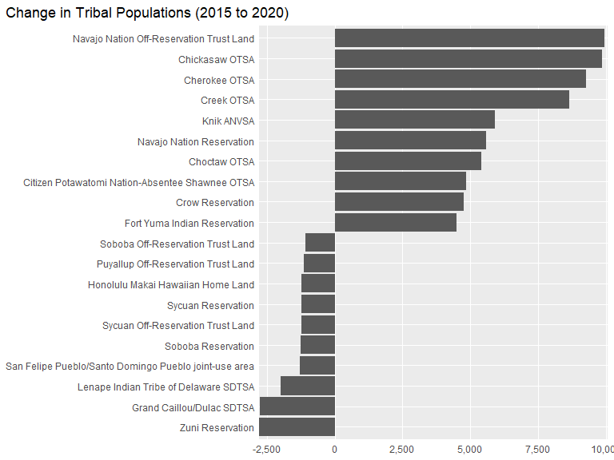
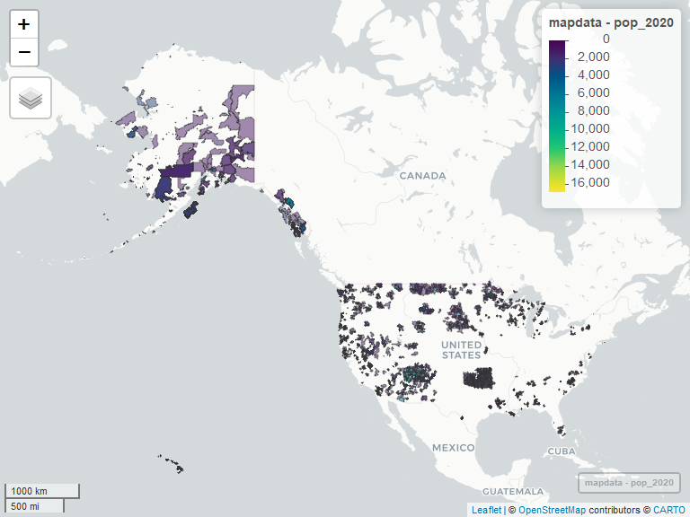

# Tribal ZIP codes

Tribal lands represent a significant portion of the land area of the
United States. It may be useful to identify the ZIP codes for those
areas (e.g., for survey sampling or analysis). However, this information
is not readily available. This document combines data from two sources
to produce a CSV reflecting the tribal population in each tribal ZIP
code.

## Method

The data we need is at <https://lehd.ces.census.gov/data/lodes/LODES8/>
and <https://udsmapper.org/zip-code-to-zcta-crosswalk/>

LEHD = Longitudinal Employer-Household Dynamics

LODES = LEHD Origin-Destination Employment Statistics

U.S. Census Bureau. (2023). LEHD Origin-Destination Employment
Statistics Data (2002-2021) \[computer file\]. Washington, DC: U.S.
Census Bureau, Longitudinal-Employer Household Dynamics Program
\[distributor\], <https://lehd.ces.census.gov/data/#lodes>. LODES 8.1
\[version\]

### LODES

``` r
library(httr)
library(data.table)
library(R.utils)

states <- tolower(state.abb)

for(i in 1:length(states)){ # i = 3
  
  cat(states[i], "\n")
  
  # URL of the file to download
    url <- glue::glue("https://lehd.ces.census.gov/data/lodes/LODES8/{states[i]}/{states[i]}_xwalk.csv.gz")
  
  # Destination file paths
    dest_file_gz  <- "xwalk.csv.gz"
    dest_file_csv <- "xwalk.csv"
  
  # Download the gzipped file
    GET(url, write_disk(dest_file_gz, overwrite = TRUE))
  
  # Unzip the file
    gunzip(dest_file_gz, dest_file_csv, remove = FALSE, overwrite = TRUE)
  
  # Read the CSV file (optional)
    temp <- 
      fread(dest_file_csv) %>% 
      as.data.frame() %>%
      select(state=stname, zcta, tribe=tribname) %>%
      mutate_all(as.character) %>%
      distinct()
  
  if(i == 1){
    lodes <- temp
  } else{
    lodes <- bind_rows(lodes, temp)
  }
    
}

# length(unique(lodes$state))

saveRDS(lodes, "lodes.rds")
```

### ZIP-ZCTA conversion

``` r
# Load necessary library
library(readxl)

# URL of the Excel file
url <- "https://udsmapper.org/wp-content/uploads/2023/09/ZIPCodetoZCTACrosswalk2022UDS.xlsx"

# Download the Excel file
download.file(url, destfile = "ZIPCodetoZCTACrosswalk2022UDS.xlsx", mode = "wb")

# Read the Excel file
zcta_zip <- 
  read_excel("ZIPCodetoZCTACrosswalk2022UDS.xlsx") %>%
  select(zip=ZIP_CODE, zcta, state=STATE) %>%
  distinct()

length(unique(zcta_zip$zip))

saveRDS(zcta_zip, "zcta_zip.rds")
```

### Population

``` r
geodata <- get_acs(
  geography = "zcta",
  variables = "B02017_001",
  geometry = TRUE,
  year = 2020) %>%
  select(zcta=GEOID, geometry) 

saveRDS(geodata, "geodata.rds")
```

``` r
# load_variables(2020, "acs5", cache = TRUE) %>% View()
# load_variables(2015, "acs5", cache = TRUE) %>% View()

pop2020 <- get_acs(
  geography = "zcta",
  variables = "B02017_001", #AMERICAN INDIAN AND ALASKA NATIVE (AIAN) ALONE OR IN ANY COMBINATION BY SELECTED TRIBAL GROUPINGS
  geometry = F,
  year = 2020) %>%
  select(zcta=GEOID, pop_2020=estimate)

pop2015 <- get_acs(
  geography = "zcta",
  variables = "B02017_001", #AMERICAN INDIAN AND ALASKA NATIVE (AIAN) ALONE OR IN ANY COMBINATION BY SELECTED TRIBAL GROUPINGS
  geometry = F,
  year = 2015) %>%
  select(zcta=GEOID, pop_2015=estimate)

tribalpops <- inner_join(pop2015, pop2020)
rm(pop2020, pop2015)

saveRDS(tribalpops, "tribalpops.rds")
```

## Results: Tribal ZIPS

### Output file

``` r
tribal_zips <-
  filter(lodes, !is.na(tribe), tribe != "") %>%
  select(-state) %>%
  inner_join(zcta_zip) %>%
  distinct() %>%
  left_join(tribalpops) %>%
  select(state, zcta, zip, tribe, pop_2015, pop_2020)

# table(tribal_zips$tribe)

head(tribal_zips)
#>   state  zcta   zip                 tribe pop_2015 pop_2020
#> 1    AL 35650 35650 Echota Cherokee SDTSA     1258     1124
#> 2    AL 36312 36312    Cher-O-Creek SDTSA      155       58
#> 3    AL 36303 36302    Cher-O-Creek SDTSA      332      349
#> 4    AL 36303 36303    Cher-O-Creek SDTSA      332      349
#> 5    AL 36303 36304    Cher-O-Creek SDTSA      332      349
#> 6    AL 36321 36321    Cher-O-Creek SDTSA       38       43

write_csv(tribal_zips, "tribal zips.csv")
```

### Exploratory analysis

``` r
temp <-
  tribal_zips %>%
  filter(!is.na(tribe)) %>%
  group_by(tribe) %>%
  summarize(pop=sum(pop_2020, na.rm=T)) %>%
  mutate(total = sum(pop),
         pct = pop/total) %>%
  arrange(desc(pct))
```

The data indicates that there are 821 tribes in the US with a 2015
population of 5,545,886 and 2020 population of 6,040,768 residents
identifying as American Indian or Alaska Native, alone or in any
combination of tribal groupings.

Here are the top 20 tribes by population as of 2020:

``` r
temp %>%
  slice(1:20) %>%
  ggplot(aes(y=reorder(tribe, pop), x=pop)) +
  geom_col() +
  scale_x_continuous(labels = scales::comma, expand = expansion(mult = c(0,.01))) +
  labs(x=NULL, y=NULL, title = "Top 20 Tribal Populations (2020)") +
  theme(axis.ticks = element_blank(),
        panel.grid.minor.x = element_blank(),
        plot.title.position = "plot"
        )
```

<!-- -->

And here are the tribes that gained and lost the most members between
2015 and 2020:

``` r
tribal_zips %>%
  filter(!is.na(tribe)) %>%
  group_by(tribe) %>%
  summarize(
    pop_2020=sum(pop_2020, na.rm=T),
    pop_2015=sum(pop_2015, na.rm=T)
    ) %>%
  mutate(change = pop_2020 - pop_2015) %>%
  arrange(change) %>%
  slice(1:10, (n()-9):n()) %>%
  ggplot(aes(y=reorder(tribe, change), x=change)) +
  geom_col() +
  scale_x_continuous(labels = scales::comma, expand = expansion(mult = c(0,.01))) +
  labs(x=NULL, y=NULL, title = "Change in Tribal Populations (2015 to 2020)") +
  theme(axis.ticks = element_blank(),
        panel.grid.minor.x = element_blank(),
        plot.title.position = "plot")
```

<!-- -->

``` r
left_join(geodata, tribal_zips) %>%
  mutate(tribal = ifelse(is.na(tribe), "No", "Yes")) %>%
  #filter(tribal=="Yes") %>%
  ggplot(aes(fill = tribal)) + 
  geom_sf(color = NA)
```

``` r
library(mapview)

mapdata <- 
  inner_join(geodata, tribal_zips) %>%
  mutate(tribal = ifelse(is.na(tribe), "No", "Yes")) 

mapview(
  mapdata, 
  zcol="pop_2020", 
  smoothFactor=.2, 
  alpha.regions = 0.5,
  popup = leafpop::popupTable(mapdata, zcol = c("zip", "tribe", "pop_2020", "pop_2015"))
  ) 
```

<!-- -->
