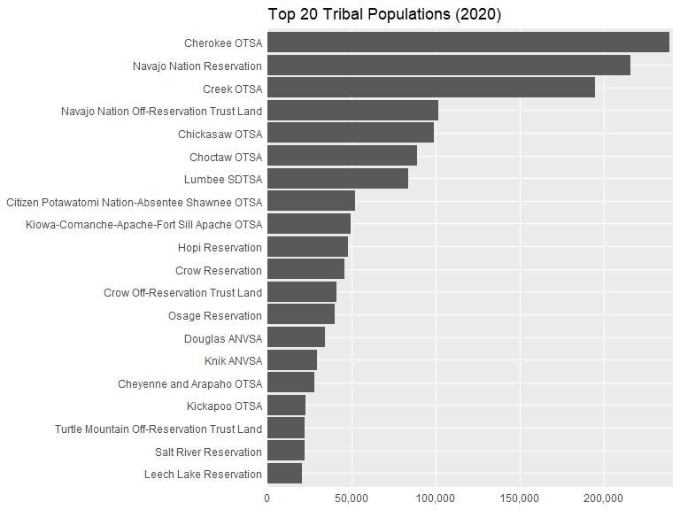
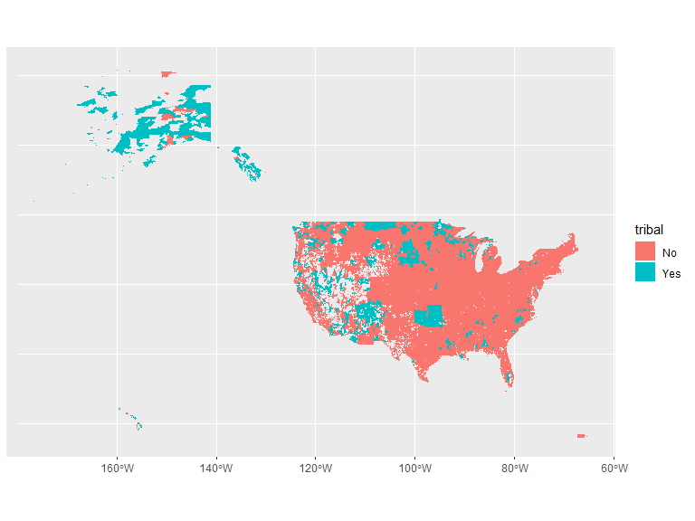

The data we need is at https://lehd.ces.census.gov/data/lodes/LODES8/ and https://udsmapper.org/zip-code-to-zcta-crosswalk/

LEHD = Longitudinal Employer-Household Dynamics

LODES = LEHD Origin-Destination Employment Statistics

U.S. Census Bureau. (2023). LEHD Origin-Destination Employment Statistics Data (2002-2021) [computer file]. Washington, DC: U.S. Census Bureau, Longitudinal-Employer Household Dynamics Program [distributor], https://lehd.ces.census.gov/data/#lodes. LODES 8.1 [version]


## LODES


```r
library(httr)
library(data.table)
library(R.utils)

states <- tolower(state.abb)

for(i in 1:length(states)){ # i = 3
  
  cat(states[i], "\n")
  
  # URL of the file to download
    url <- glue::glue("https://lehd.ces.census.gov/data/lodes/LODES8/{states[i]}/{states[i]}_xwalk.csv.gz")
  
  # Destination file paths
    dest_file_gz  <- "xwalk.csv.gz"
    dest_file_csv <- "xwalk.csv"
  
  # Download the gzipped file
    GET(url, write_disk(dest_file_gz, overwrite = TRUE))
  
  # Unzip the file
    gunzip(dest_file_gz, dest_file_csv, remove = FALSE, overwrite = TRUE)
  
  # Read the CSV file (optional)
    temp <- 
      fread(dest_file_csv) %>% 
      as.data.frame() %>%
      select(state=stname, zcta, tribe=tribname) %>%
      mutate_all(as.character) %>%
      distinct()
  
  if(i == 1){
    lodes <- temp
  } else{
    lodes <- bind_rows(lodes, temp)
  }
    
}

# length(unique(lodes$state))

saveRDS(lodes, "lodes.rds")
```


## ZIP-ZCTA conversion


```r
# Load necessary library
library(readxl)

# URL of the Excel file
url <- "https://udsmapper.org/wp-content/uploads/2023/09/ZIPCodetoZCTACrosswalk2022UDS.xlsx"

# Download the Excel file
download.file(url, destfile = "ZIPCodetoZCTACrosswalk2022UDS.xlsx", mode = "wb")

# Read the Excel file
zcta_zip <- 
  read_excel("ZIPCodetoZCTACrosswalk2022UDS.xlsx") %>%
  select(zip=ZIP_CODE, zcta, state=STATE) %>%
  distinct()

length(unique(zcta_zip$zip))

saveRDS(zcta_zip, "zcta_zip.rds")
```


## Tribal ZIPS


```r
tribal_zips <-
  filter(lodes, !is.na(tribe), tribe != "") %>%
  select(-state) %>%
  inner_join(zcta_zip) %>%
  distinct()

# table(tribal_zips$tribe)

write_csv(tribal_zips, "tribal zips.csv")
```

## Map


```r
geodata <- get_acs(
  geography = "zcta",
  variables = "B02017_001",
  geometry = TRUE,
  year = 2020
) %>%
  dplyr::rename(zcta=GEOID, pop=estimate)

saveRDS(geodata, "geodata.rds")
```


```r
temp <-
  geodata %>%
  select(zcta, pop) %>%
  as.data.frame() %>%
  inner_join(tribal_zips) %>%
  filter(!is.na(tribe)) %>%
  group_by(tribe) %>%
  summarize(pop=sum(pop, na.rm=T)) %>%
  mutate(total = sum(pop),
         pct = pop/total) %>%
  arrange(desc(pct)) 

sum(temp$pop)
#> [1] 3301639


temp %>%
  slice(1:20) %>%
  ggplot(aes(y=reorder(tribe, pop), x=pop)) +
  geom_col() +
  scale_x_continuous(labels = scales::comma, expand = expansion(mult = c(0,.01))) +
  labs(x=NULL, y=NULL, title = "Top 20 Tribal Populations (2020)") +
  theme(axis.ticks = element_blank(),
        panel.grid.minor.x = element_blank())
```

<!-- -->


```r
left_join(geodata, tribal_zips) %>%
  mutate(tribal = ifelse(is.na(tribe), "No", "Yes")) %>%
  #filter(tribal=="Yes") %>%
  ggplot(aes(fill = tribal)) + 
  geom_sf(color = NA)
```

<!-- -->
